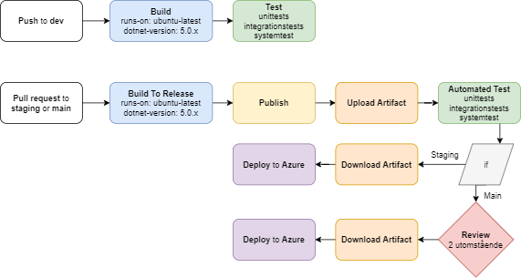

# Status
Staging:  
  
Dev:  
  

# Tester
* Vi har valt Systemtest för att testa programet som helhet.
* Vi har valt UnitTester för att testa alla metoder i beckend-delen.
* Vi har valt SanityTest för att kunna utesluta dumma och uppenbara fel i tidigt stadium.
* Vi har valt AcceptansTester för att kontrollera att alla funktioner finns på plats.
* Vi har valt IntegrationTest för att testa att alla enheter i applikationen fungerar tillsammans och för att hitta buggar så tidigt som möjligt.

# Issues:  
Issues: Vi har enbart använt GitHub issues i syfte att testa på funktionerna som finns. Vi ansåg dock att det var överflödigt då vi haft regelbundna avstämningar i gruppen och att man hade chansen att dela problemen vi hade under våra avstämningar. Vi har även haft som regel att vi skriver i chatten när vi stöter på problem, och då samlas vi och stöttar varandra, i syfte att utnyttja varandras kompetens för att kunna sprida kunskap inom gruppen. 
Vi har dock diskuterat och inser att det hade varit mycket användbart i ett större projekt där man inte jobbar som ett team som vi gjort i denna uppgift. 

# Status badges:  
Vi har valt att använda oss av status badges i readme-filen för att snabbt kunna se status på senaste workflow runet i respektive miljö.

# Status badges:

# Länkar
* Länk till Production:
https://geometre.azurewebsites.net/

* Länk till Staging:
https://geometrestaging.azurewebsites.net/
